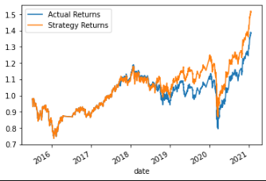
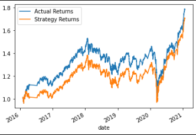
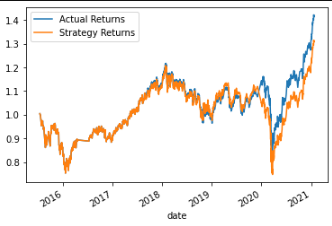
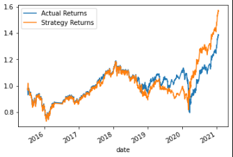

# Machine Learning Trading Bot
This project implements an algorithmic trading strategy that uses machine learning to automate trading decisions. In the project I created 4 different models: 3 Support Vector Machine (SVM) models including 1 baseline model and 2 models with adjusted inputs, and an AdaBoost model. The goal of the project is to use backtesting to compare the models and determine which one produced the most accurate predictions.


Challenge Scanario:
> You’ll assume the role of a financial advisor at one of the top five financial advisory firms in the world. Your firm constantly competes with the other major firms to manage and automatically trade assets in a highly dynamic environment. In recent years, your firm has heavily profited by using computer algorithms that can buy and sell faster than human traders. 
The speed of these transactions gave your firm a competitive advantage early on. But, people still need to specifically program these systems, which limits their ability to adapt to new data. You’re thus planning to improve the existing algorithmic trading systems and maintain the firm’s competitive advantage in the market. To do so, you’ll enhance the existing trading signals with machine learning algorithms that can adapt to new data.

---

## Model Results and Comparison

### Baseline Classifier
This SVC model serves as a baseline to which the other models can be compared. The backtesting results of this model are as follows:

#### Classification Report:

```

              precision    recall  f1-score   support

        -1.0       0.43      0.04      0.07      1804
         1.0       0.56      0.96      0.71      2288

    accuracy                           0.55      4092
   macro avg       0.49      0.50      0.39      4092
weighted avg       0.50      0.55      0.43      4092
```

#### Plot of Actual Returns vs. Predicted Returns



### Adjusted Training Window Model
This model takes the same parameters as the baseline classifier except for the testing and training windows. For this model, I increased the length of the training window from 3 months to 10 months. The backtesting results are as follows:

#### Classification Report

```
              precision    recall  f1-score   support

        -1.0       0.43      0.03      0.05      1549
         1.0       0.57      0.97      0.72      2017

    accuracy                           0.56      3566
   macro avg       0.50      0.50      0.38      3566
weighted avg       0.51      0.56      0.43      3566
```

#### Plot of Actual Returns vs. Predicted Returns



### Adjusted SMA model: 
This model takes the same parameters as the baseline classifier except for the SMA windows. For this model, I changed the length of the short-window SMA to 20 and the long-window SMA to 150. The backtesting results are as follows:

#### Classification Report:

```
              precision    recall  f1-score   support

        -1.0       0.54      0.01      0.02      1791
         1.0       0.56      0.99      0.72      2278

    accuracy                           0.56      4069
   macro avg       0.55      0.50      0.37      4069
weighted avg       0.55      0.56      0.41      4069
```

#### Plot of Actual Returns vs. Predicted Returns



### Question: Which set of parameters best improved the trading algorithm results?

Comparing the two alternative models, it is difficult to determine which model is better because in the accuracy reports, each model had better scores in some areas but worse in others. For example, the adjusted training window model had better recall and F-1 scores for the -1 signal than the adjusted SMA model, but the adjusted SMA model had better precision for the -1 signal. The two models also have the same accuracy score. Looking at the plots of the cumulative product, it initially seems like the adjusted SMA model's predictions were closer to the testing data, but we have to take into account that the two models have different testing data values and the two plots have different values on the y axis, which makes it difficult to make an objective comparison.

### Adaboost Model
In this section we were asked to test and evaluate a different machine learning model with the same inputs as the baseline SVM model. For this model I chose to use the AdaBoost machine learning algorithm. The backtesting results are as follows:

#### Classification Report:

```
              precision    recall  f1-score   support

        -1.0       0.44      0.08      0.13      1804
         1.0       0.56      0.92      0.70      2288

    accuracy                           0.55      4092
   macro avg       0.50      0.50      0.41      4092
weighted avg       0.51      0.55      0.45      4092

```

#### Plot of Actual Returns vs. Predicted Returns



### Question: Did this new model perform better or worse than the provided baseline model?
The AdaBoost model seems to have been better at predicting the -1 (selling) signals than the baseline model, because its precision, recall, and F-1 score for the -1 values were better. It seems to be mostly the same or slightly worse than the baseline at predicting the 1.0 (buying) signals. The accuracy score for this model is the same as the baseline model.

### Question: Did this new model perform better or worse than your tuned trading algorithm?
For the -1 (selling) signals, the AdaBoost model seems to have performed better than both of the tuned SVM models, with better recall and F-1 score, although its precision was worse than the adjusted SMA model. For the 1.0 (buying) signals, its performance was similar or slightly worse than the tuned SVM models. The accuracy score for the AdaBoost model was 1% lower than the two other models.

---

## Technologies
* Python 3.9
* Python libraries: Pandas, Numpy, Pathlib, Matplotlib, Scikit-learn
* Machine Learning Models: SVM, AdaBoost
* Jupyter Lab and Jupyter Notebooks

---

## Contributors

Lydia Ciummo

---

## License

GNU General Public License v3.0